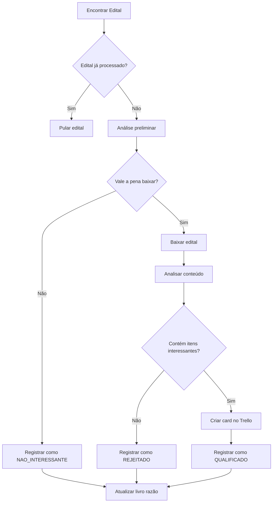

# Metodologia de Controle de Editais Processados

## Visão Geral

Este sistema implementa uma metodologia inteligente para evitar downloads duplicados e processar apenas editais pertinentes, baseado em um "livro razão" que controla todos os editais já processados.

## Componentes do Sistema

### 1. Livro Razão (`livro_razao_controller.py`)

O livro razão é um arquivo Excel (`livro_razao_editais.xlsx`) que mantém o registro de todos os editais processados com as seguintes colunas:

- **ID_Edital**: Identificador único (UASG_NumeroEdital)
- **UASG**: Código UASG do edital
- **Numero_Edital**: Número do edital
- **Comprador**: Nome do comprador
- **Data_Disputa**: Data da disputa
- **Data_Processamento**: Data/hora do processamento
- **Status**: QUALIFICADO, REJEITADO, ou NAO_INTERESSANTE
- **Itens_Interessantes**: Quantidade de itens interessantes encontrados
- **Percentual_Interesse**: Percentual de itens interessantes
- **Arquivo_Download**: Nome do arquivo baixado
- **Card_Trello_ID**: ID do card criado no Trello

### 2. Sistema de Filtragem Inteligente

#### Análise Preliminar
Antes de baixar qualquer edital, o sistema realiza uma análise preliminar baseada em:

1. **Contexto do Edital**: Analisa o texto visível na página para identificar palavras-chave relacionadas a:
   - Instrumentos musicais
   - Equipamentos de áudio
   - Escolas, colégios, universidades
   - Conservatórios

2. **Comprador**: Verifica se o comprador tem características que indicam interesse em produtos musicais

#### Palavras-Chave de Filtro
```python
PALAVRAS_CHAVE = [
    'Instrumento Musical - Sopro', 'Instrumento Musical - Corda', 'Instrumento Musical - Percursão',
    'saxofone', 'trompete', 'tuba', 'clarinete', 'violão', 'Guitarra', 'Baixo', 'Violino',
    'Microfone', 'Caixa Acústica', 'Amplificador de áudio', 'Piano', 'Mesa áudio',
    # ... e outras palavras-chave
]
```

### 3. Fluxo de Processamento



## Benefícios da Metodologia

### 1. Evita Downloads Duplicados
- **Controle por ID único**: Cada edital é identificado por `UASG_NumeroEdital`
- **Verificação prévia**: Antes de qualquer download, verifica se já foi processado
- **Histórico completo**: Mantém registro de todos os editais processados

### 2. Filtragem Inteligente
- **Análise preliminar**: Evita downloads desnecessários
- **Palavras-chave específicas**: Foca apenas em produtos musicais e de áudio
- **Contexto do comprador**: Considera o tipo de instituição

### 3. Eficiência Operacional
- **Reduz tempo de processamento**: Não reprocessa editais já analisados
- **Economia de recursos**: Evita downloads desnecessários
- **Qualidade dos dados**: Foca apenas em editais relevantes

### 4. Rastreabilidade
- **Relatórios detalhados**: Gera estatísticas completas
- **Auditoria**: Permite verificar histórico de processamento
- **Métricas de performance**: Acompanha eficiência do sistema

## Arquivos Gerados

### 1. Livro Razão (`livro_razao_editais.xlsx`)
- Registro completo de todos os editais processados
- Histórico de decisões tomadas
- Base para evitar reprocessamento

### 2. Relatório de Filtragem (`relatorio_filtragem.xlsx`)
- Estatísticas da execução atual
- Detalhes dos editais qualificados e rejeitados
- Métricas de performance

### 3. Planilha de Controle (`EDITAIS_PC.xlsx`)
- Registro dos cards criados no Trello
- Informações para acompanhamento

## Como Usar

### 1. Primeira Execução
```python
from arte_orquestra_controlado import WavecodeAutomationControlado

automation = WavecodeAutomationControlado()
automation.run(max_pages_to_process=5)
```

### 2. Execuções Subsequentes
- O sistema automaticamente carrega o livro razão existente
- Processa apenas editais não processados anteriormente
- Mantém histórico completo

### 3. Monitoramento
- Verificar estatísticas no livro razão
- Analisar relatórios de filtragem
- Acompanhar cards criados no Trello

## Configurações

### Palavras-Chave
As palavras-chave podem ser ajustadas no arquivo principal:
```python
PALAVRAS_CHAVE = [
    # Adicionar ou remover palavras-chave conforme necessário
]
```

### Diretórios
```python
BASE_DIR = r"G:\Meu Drive\arte_comercial"
DOWNLOAD_DIR = os.path.join(BASE_DIR, "DOWNLOADS")
LIVRO_RAZAO_PATH = os.path.join(BASE_DIR, "livro_razao_editais.xlsx")
```

## Vantagens Competitivas

1. **Eficiência**: Reduz drasticamente o tempo de processamento
2. **Precisão**: Foca apenas em editais relevantes
3. **Escalabilidade**: Pode processar grandes volumes sem reprocessamento
4. **Rastreabilidade**: Histórico completo de todas as operações
5. **Automação**: Sistema totalmente automatizado e inteligente

## Manutenção

### Backup do Livro Razão
- Fazer backup regular do arquivo `livro_razao_editais.xlsx`
- Manter histórico de versões

### Atualização de Palavras-Chave
- Revisar periodicamente as palavras-chave
- Adicionar novos termos conforme necessário

### Monitoramento de Performance
- Acompanhar estatísticas de qualificação
- Ajustar critérios conforme resultados
