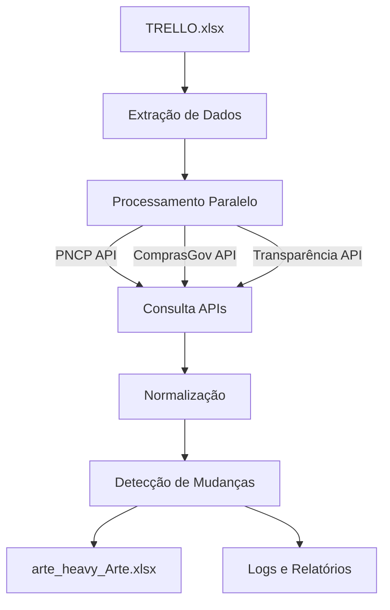

# Sistema de Monitoramento de Licitações PNCP

Sistema integrado para monitoramento de licitações governamentais através de múltiplas APIs.

## Fluxo de Dados



## Estrutura do Projeto

```
PNCP/
├── config_endpoints.py     # Configurações e endpoints
├── utils_licitacoes.py    # Funções utilitárias
├── endpoints_estruturados.py   # Gerenciamento de endpoints
├── teste_endpoints_licitacoes.py   # Validação
├── api_consolidada.py     # Interface unificada
├── monitoramento_licitacoes_melhorado.py  # Core
└── relatorio_endpoints_funcionais.py   # Relatórios
```

## Variáveis de Ambiente

```python
# Configuráveis em config_endpoints.py
COMPANY_CNPJ = "05019519000135"
PNCP_BASE_URL = "https://pncp.gov.br/api/v1"
COMPRASGOV_BASE_URL = "https://compras.dados.gov.br"
TRANSPARENCIA_BASE_URL = "https://api.portaldatransparencia.gov.br/api-de-dados"
```

## Patios (Diretórios)

```python
# Entradas
INPUT_DIR = r"C:\Users\pietr\OneDrive\.vscode\arte_"
MASTER_FILE = "TRELLO.xlsx"

# Saídas
OUTPUT_DIR = r"C:\Users\pietr\OneDrive\.vscode\arte_\DOWNLOADS\RESULTADO"
RESULT_FILE = "arte_heavy_Arte.xlsx"
```

## Fluxo de Execução

1. **Inicialização**
```python
monitor = TenderMonitor()
monitor.load_previous_results()  # Carrega resultados anteriores
```

2. **Processamento de Dados**
```python
def process_tender(self, row):
    response = self.api_client.get_tender_status(
        str(row["UASG"]),
        str(row["EDITAL"])
    )
    return self.api_client.normalize_response(response)
```

3. **Consulta APIs**
```python
class UnifiedAPIClient:
    def get_tender_status(self, uasg, edital):
        results = {}
        for client in self.clients:
            info = client.get_tender_info(uasg, edital)
            results[client.__class__.__name__] = {
                "info": info,
                "results": client.get_tender_results(uasg, edital)
            }
        return results
```

4. **Normalização de Respostas**
```python
def normalize_response(self, response):
    return {
        "status": self._determine_status(response),
        "rank": self._extract_rank(response),
        "adjudicada": self._check_adjudicacao(response)
    }
```

## Estados de Licitação

- **Aguardando Disputa**: Licitação ainda não iniciada
- **Rank N**: Posição atual na disputa
- **Adjudicada**: Licitação ganha pela A.R.T.E.
- **Perdida**: Licitação perdida ou desclassificada

## Modularização

O sistema é modularizado em camadas:

1. **Configuração** (`config_endpoints.py`)
   - Centraliza todas as configurações
   - Facilita manutenção

2. **Utilitários** (`utils_licitacoes.py`)
   - Funções reutilizáveis
   - Processamento de dados

3. **API** (`api_consolidada.py`)
   - Interface unificada
   - Tratamento de erros
   - Rate limiting

4. **Monitoramento** (`monitoramento_licitacoes_melhorado.py`)
   - Lógica principal
   - Processamento paralelo

5. **Relatórios** (`relatorio_endpoints_funcionais.py`)
   - Geração de relatórios
   - Análise de dados

## Resultados Esperados

1. **arte_heavy_Arte.xlsx**
```python
{
    "UASG": "123456",
    "EDITAL": "789/2025",
    "Item": "1",
    "Status": "Rank 2",
    "Adjudicada": False,
    "Última Atualização": "2025-09-10T10:30:00"
}
```

2. **Relatórios de Performance**
- Taxa de sucesso por API
- Tempo médio de resposta
- Endpoints funcionais
- Mudanças de status

## Tratamento de Erros

```python
try:
    response = self._make_request(url, params)
    if utils.validate_api_response(response, api_type):
        return self.process_response(response)
    return self.fallback_response()
except APIError:
    logger.error(f"API Error: {url}")
    return self.error_response()
```

## Rate Limiting

```python
@sleep_and_retry
@limits(calls=60, period=60)
def _make_request(self, url, params):
    return self.session.get(url, params=params)
```

## Logs

- **Local**: arte_orchestrator.log
- **Formato**: `%(asctime)s - %(name)s - %(levelname)s - %(message)s`
- **Níveis**: INFO, ERROR, WARNING

## Quick Start

1. **Instalação**
```bash
pip install -r requirements.txt
```

2. **Configuração**
- Ajuste paths em `config_endpoints.py`
- Verifique CNPJ da empresa

3. **Execução**
```bash
python monitoramento_licitacoes_melhorado.py
```

4. **Monitoramento**
```bash
tail -f arte_orchestrator.log
```

## Manutenção

- Atualize URLs das APIs em `config_endpoints.py`
- Monitore logs para erros recorrentes
- Verifique rate limits periodicamente
- Mantenha backups dos resultados

## Integração

O sistema pode ser integrado com:
- Sistemas de notificação
- Dashboards
- Banco de dados
- Webhooks
